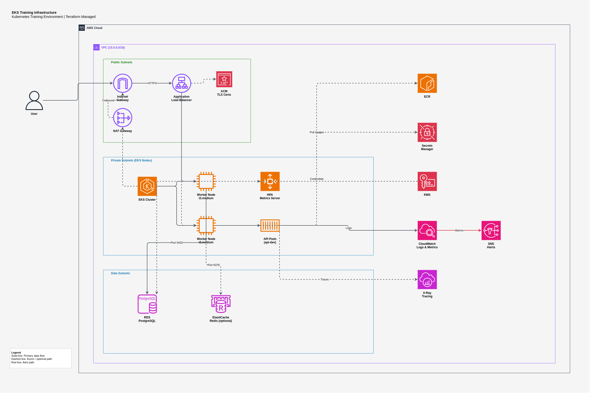

# EKS Training Infrastructure — Architecture Diagram

## Overview

This diagram shows the AWS infrastructure provisioned by the Terraform root module for Kubernetes training. It follows a single-region, multi-AZ pattern optimized for cost.

## Request Flow

1. **User** → Internet Gateway → ALB (TLS terminated via ACM certificate)
2. **ALB** → EKS Worker Nodes (port 8080) in private subnets
3. **Worker Nodes** run API pods across namespaces (api-dev, api-qa, api-prod)
4. **API Pods** → RDS PostgreSQL (port 5432) and optionally ElastiCache Redis (port 6379) in data subnets
5. **Worker Nodes** → NAT Gateway → Internet Gateway for outbound traffic (ECR pulls, external APIs)

## Components

| Service | Purpose |
|---|---|
| **VPC** | Network isolation with public, private, and data subnets |
| **Internet Gateway** | Inbound internet access to public subnets |
| **NAT Gateway** | Outbound internet for private subnets (single AZ for cost) |
| **ALB** | HTTPS ingress with TLS termination, path-based routing |
| **ACM** | TLS certificates for ALB |
| **EKS Cluster** | Kubernetes control plane |
| **Worker Nodes** | EC2 t3.medium instances running pods |
| **HPA / Metrics Server** | Horizontal Pod Autoscaler for production overlay |
| **RDS PostgreSQL** | Application database (db.t3.micro, encrypted) |
| **ElastiCache Redis** | Optional caching layer (disabled by default) |
| **ECR** | Container image registry with scan-on-push |
| **Secrets Manager** | DB credentials injected via External Secrets Operator |
| **KMS** | Encryption at rest for RDS and ElastiCache |
| **CloudWatch** | Centralized logs, metrics, and Container Insights |
| **SNS** | Alert delivery from CloudWatch Alarms |
| **X-Ray** | Distributed request tracing |

## Security Controls

- TLS 1.2+ on ALB ingress (ACM certificate)
- Worker nodes in private subnets (no public IPs)
- Security groups per tier: ALB → Nodes → Data
- KMS encryption at rest for RDS and ElastiCache
- Secrets Manager for credentials (never in code or env files)
- ECR image scanning on push
- Network policies restrict pod-to-pod traffic

## Cost Optimization

- NAT Gateway: single AZ (not per-AZ)
- ElastiCache: disabled by default
- Node group: min_size=0 allows scaling to zero between sessions
- RDS: db.t3.micro with single-AZ, 1-day backup retention
- CloudWatch: 7-day log retention

## Opening the Diagram

Open `eks-training-infrastructure.drawio` in:
- [draw.io desktop app](https://github.com/jgraph/drawio-desktop/releases)
- [app.diagrams.net](https://app.diagrams.net) (web)
- VS Code with the Draw.io Integration extension
